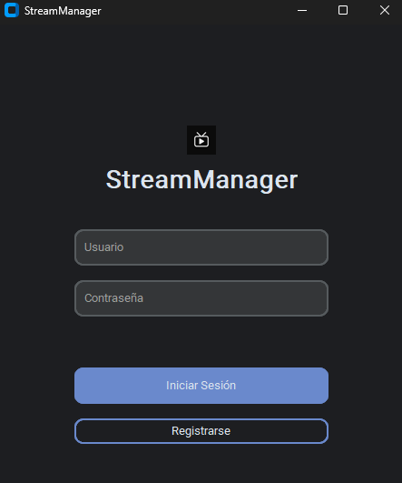

<em> # Este es un programa de libre uso, desarrollado y subido por el autor Eztbn. </em>

<h1 align="center"> #StreamManager: Gestión de Inventario de Cuentas de Streaming</h1>

La aplicación cuenta con una interfaz gráfica intuitiva y un sistema de monetización seguro a través de claves premium validadas por una API remota.

✨ Características Principales
Gestión de Inventario: Añade, edita y elimina cuentas de tu inventario (Netflix, Spotify, etc.) de forma centralizada.

Sistema de Alquileres Múltiples: Alquila una misma cuenta a varios usuarios simultáneamente y lleva un control preciso de quién la está usando.

Historial de Ventas: Mantén un registro detallado de todos los alquileres, con información del comprador, fechas y un ID único por transacción.

Dashboard de Análisis: Visualiza estadísticas clave de tu negocio de un vistazo: total de cuentas, disponibles, y número de alquileres activos.

Notificaciones Inteligentes: Recibe alertas de los alquileres que están próximos a vencer para poder gestionar las renovaciones a tiempo.

Seguridad Robusta:

Encriptación de Contraseñas: Todas las contraseñas de las cuentas se guardan cifradas en la base de datos local.

API Remota para Claves Premium: Las claves de activación de la membresía Premium se validan contra un servidor seguro en la nube, asegurando que no puedan ser extraídas o robadas del programa cliente.

Interfaz Moderna: Diseño limpio y profesional con temas claro y oscuro, desarrollado con CustomTkinter.

Búsqueda y Filtrado: Encuentra rápidamente cualquier cuenta o alquiler gracias a las barras de búsqueda integradas.
